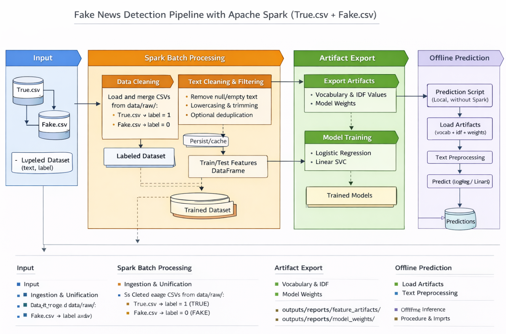

Fake News Detection – Big Data Text Classification Pipeline (Apache Spark)

Overview

This project implements a batch Big Data pipeline for fake news detection using Apache Spark and Spark MLlib.
The pipeline processes a large collection of news articles, extracts textual features in a distributed manner, trains multiple machine learning models, evaluates their performance, and produces artifacts that can be reused for prediction.

The focus of the project is on scalable text processing and machine learning using Spark, not on user interfaces or online deployment.

The dataset used in this project is the Fake News Detection Datasets collection published on Kaggle by the user emineyetm.
It contains news articles labeled as either fake or real and is commonly used for supervised text classification tasks.

In the current implementation, the dataset consists of two separate CSV files:

True.csv, containing real news articles

Fake.csv, containing fake news articles

Each file includes multiple attributes describing a news article. The pipeline primarily uses the textual content of the articles for classification, while additional fields are retained when available.

Typical columns present in the dataset include:

the title of the news article

the full textual content of the article

the subject or category of the news (optional)

the publication date (optional)

During the ingestion stage, the two CSV files are loaded separately using Apache Spark.
A label column is added explicitly:

articles from True.csv are assigned the label value 1, representing REAL news

articles from Fake.csv are assigned the label value 0, representing FAKE news

After labeling, the two datasets are merged into a single Spark DataFrame.
This unified dataset is then processed by the rest of the pipeline using a common internal schema, ensuring consistency across all subsequent stages.

What the Pipeline Does

The project implements a complete processing workflow that transforms raw news articles into machine learning predictions.
The pipeline is executed as a batch job using Apache Spark and consists of several well-defined stages.

First, the pipeline loads raw CSV files into Spark DataFrames. During this stage, different dataset layouts are handled automatically. Column names are normalized, missing columns are handled, and datasets containing separate fake and real articles are merged and labeled.

Second, the pipeline performs text cleaning and preprocessing. Articles with missing or empty text are removed. The remaining text is normalized by converting it to lowercase and removing unnecessary characters. Optional steps such as deduplication and minimum text length filtering can be applied to reduce noise in the data.

Third, textual features are extracted using Spark ML feature transformers. Each article is tokenized using regular expressions, stopwords are removed, and the remaining tokens are converted into numerical features using a TF-IDF representation. This step produces high-dimensional sparse vectors that capture the importance of words across the entire dataset. Feature computation is distributed across Spark executors.

Fourth, machine learning models are trained using the extracted features. The project trains multiple linear classification models supported by Spark MLlib, specifically Logistic Regression and Linear Support Vector Classification. The same feature representation is used for all models to ensure a fair comparison.

Fifth, trained models are evaluated on a held-out test dataset. Standard classification metrics such as accuracy, precision, recall, and F1-score are computed. A confusion matrix is also generated to analyze classification errors.

Finally, the pipeline exports artifacts required for reproducibility and prediction. These include the learned vocabulary, IDF values, and model coefficients. These artifacts allow the trained models to be reused without retraining.

Technologies Used

The project is implemented using Apache Spark version 4.1.1 and PySpark for distributed data processing and machine learning.
Python is used as the main programming language, and Java 17 is required to run Spark locally.
All processing is performed on a local Windows machine without cloud infrastructure.

Project Structure

The project is organized into logical modules that reflect the stages of the pipeline.
Data ingestion and cleaning are implemented separately from feature engineering and model training.
Utility modules handle Spark configuration and logging.
Outputs such as evaluation metrics, feature artifacts, and model weights are written to dedicated directories.

Raw datasets and intermediate processed data are excluded from version control to keep the repository clean and reproducible.

Execution Modes

The pipeline supports multiple execution modes.
A debug mode runs the pipeline on a small subset of the data for quick testing and development.
A full mode runs the pipeline on the entire dataset and is used for final experiments and evaluation.

On a standard local machine, running the pipeline in full mode typically takes approximately three to four minutes.
Most of the execution time is spent during distributed TF-IDF feature computation and model training.

Spark Optimizations

Several Spark optimizations are applied to improve performance and demonstrate Big Data best practices.
Intermediate DataFrames that are reused across multiple stages are cached or persisted to avoid recomputation.
Data is repartitioned before computationally expensive transformations to increase parallelism.
Output files are coalesced before writing to reduce the number of small files generated.

Spark configuration parameters such as the number of shuffle partitions are explicitly set to balance performance and resource usage.

Prediction

Prediction is performed using a separate script that loads the exported feature artifacts and model parameters.
The same preprocessing and feature extraction logic is applied to new input text.
Prediction is executed locally without Spark to avoid unnecessary overhead for small inference workloads.

This design separates training and inference and reflects common practices used in real-world data processing systems.

Limitations

The current approach uses a bag-of-words TF-IDF representation, which does not capture word order or semantic relationships.
As a result, the model may struggle with sarcasm, irony, or subtle contextual cues.
Stopword handling during offline prediction may differ slightly from Spark’s internal implementation.

Conclusion

This project provides a complete and reproducible Big Data pipeline for fake news detection using Apache Spark.
It demonstrates how large-scale text data can be processed, transformed, and analyzed using distributed computing techniques.
The project fulfills the requirements of a Big Data academic assignment and serves as a foundation for further experimentation and extension.

ARCHITECTURE SCHEMA
Batch Big Data Pipeline for Fake News Detection (Apache Spark)

Input Data Layer

1.1 Raw Data Sources
The input consists of two CSV datasets that represent the two classes:

True.csv: real news articles

Fake.csv: fake news articles

Each dataset contains one row per article. The pipeline primarily uses the article text for classification. Other fields (if present) such as title, subject/category, and date are retained when available.

1.2 Label Construction and Unified Dataset
The two datasets are ingested separately and a label column is assigned:

label = 1 for articles originating from True.csv (REAL)

label = 0 for articles originating from Fake.csv (FAKE)

After labeling, both datasets are merged into a single labeled dataset used by all subsequent stages.

1.3 Internal Working Schema
After ingestion, the pipeline works with a consistent internal schema:

id (optional)

title (optional)

text (required)

subject (optional)

date (optional)

label (required, integer 0/1)

Spark Batch Processing Layer

2.1 Ingestion and Unification (Spark DataFrame)
This stage loads the two CSV files into Spark DataFrames, assigns labels, and merges them into a single dataset. Rows with missing or invalid text content are removed early to reduce unnecessary processing.

Output: df_raw_labeled

2.2 Text Cleaning and Filtering (Spark DataFrame)
The labeled dataset is cleaned to ensure consistent downstream processing:

remove null or empty text rows

normalize text (lowercasing, trimming)

filter out noisy characters or non-informative tokens (depending on implementation)

optional: deduplication and minimum text length filtering

Because the cleaned dataset is reused for training, evaluation, and potentially multiple models, it is a suitable point for caching or persistence.

Output: df_clean

2.3 Train/Test Split (Spark)
The cleaned dataset is split into training and test partitions using a fixed random seed to ensure reproducible experiments.

Output: df_train, df_test

2.4 Feature Engineering (Spark ML Pipeline)
Feature extraction is performed using a Spark ML pipeline that transforms raw text into TF-IDF vectors:

Stage 1: RegexTokenizer

input: text

output: tokens

Stage 2: StopWordsRemover

input: tokens

output: filtered_tokens

Stage 3: CountVectorizer

input: filtered_tokens

output: tf (term-frequency vector)

Stage 4: IDF

input: tf

output: features (TF-IDF vector)

The output features are high-dimensional sparse vectors that scale well for large text corpora.

Output: df_train_features, df_test_features (with “features” column)

2.5 Model Training (Spark MLlib)
Two supervised classifiers are trained using the TF-IDF features:

Logistic Regression

Linear Support Vector Classification (LinearSVC)

Each model is trained on the training split and produces predictions on the test split.

Output: trained models, test predictions

2.6 Evaluation (Spark)
Model performance is evaluated on the test set using standard classification metrics:

accuracy

precision

recall

F1-score

confusion matrix

Optionally, examples of false positives and false negatives can be sampled to illustrate typical failure cases.

Output: evaluation reports (saved to disk)

Output and Artifact Layer

3.1 Exported Feature Artifacts
To ensure reproducibility and enable reuse of the exact feature space, the following artifacts are exported:

CountVectorizer vocabulary (mapping tokens to indices)

IDF values (aligned with vocabulary indices)

feature metadata (e.g., binary_tf setting)

These artifacts allow deterministic reconstruction of TF-IDF features outside the training pipeline.

3.2 Exported Model Artifacts
Model parameters are exported for inference reuse:

coefficients and intercept for Logistic Regression

coefficients and intercept for LinearSVC

Prediction Layer (Offline Inference)

4.1 Artifact-based Inference
Prediction is performed by loading the exported artifacts (vocabulary, IDF values, and model parameters) and applying the same preprocessing and TF-IDF computation steps to new text inputs.

4.2 Prediction Output
For Logistic Regression, inference produces a probability score and a binary prediction.
For LinearSVC, inference produces a margin score and a binary prediction.

Predictions can be printed to the console and optionally saved to an output file.

Performance and Observability

The pipeline logs execution time for major stages such as:

ingestion and unification

cleaning

feature engineering (dominant cost)

model training

evaluation and artifact export

In full mode, the complete pipeline typically runs in approximately 3–4 minutes on a local machine, with TF-IDF feature computation and model training being the main contributors to runtime.

Execution Modes

The pipeline supports two execution modes: debug and full.

Debug Mode

Debug mode runs the pipeline on a reduced subset of the dataset.
It is intended for development, testing, and validation of the pipeline logic.

In debug mode:

only a small sample of the data is processed

execution time is significantly reduced

all pipeline stages are executed (ingestion, preprocessing, feature engineering, training, evaluation)

This mode is useful for:

verifying that the pipeline runs correctly

testing code changes without waiting for a full execution

development on machines with limited resources

Full Mode

Full mode runs the pipeline on the complete dataset.
This mode is used for final experiments, evaluation, and reporting.

In full mode:

the entire dataset is processed

TF-IDF feature extraction and model training are executed on all data

execution time reflects the real computational cost of the pipeline

On a standard local machine, full mode execution typically takes approximately 3–4 minutes.

Terminal Commands
Run pipeline in debug mode
py run_pipeline.py --mode debug

Run pipeline in full mode
py run_pipeline.py --mode full

Run offline prediction on a CSV file
py predict.py --model linearsvc --input_csv data/predict/predict_samples.csv --text_col text --reports_dir outputs/reports